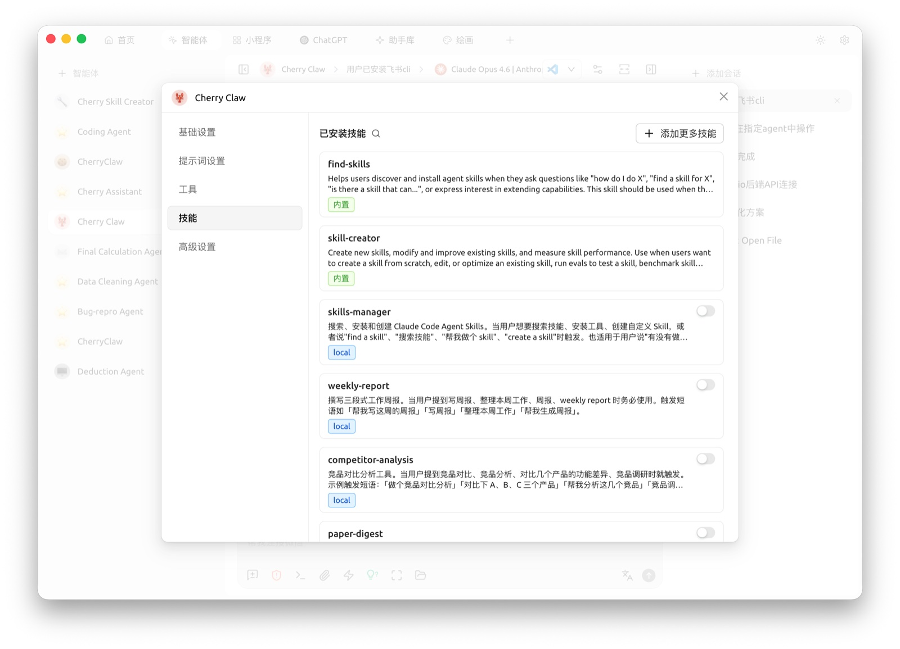

# 技能（Skills）

**技能为 AI 加装专业能力组件**。

类比：手机出厂自带相机、地图、计算器等基础应用，但若需要观看短视频则需安装抖音、若需要点外卖则需安装美团 —— **应用扩展了手机的专项能力**。

Cherry Studio 中的 AI 同样如此：默认具备对话能力，若需要"撰写小红书图文"、"起草专利申请"、"绘制 Mermaid 流程图"等专项任务，可**为其加装对应的技能**。

* **可加装对象**：[助手](../../cherrystudio/preview/agents.md) 或 [智能体](../../advanced-basic/agent.md)
* **不可加装对象**：底层模型。技能属于 Cherry Studio 层的能力，不影响模型本身
* **启用效果**：处理相关任务时，AI 自动按技能定义的专业方式响应

> 推荐先阅读 [概念入门](../../advanced-basic/concepts-101.md) 了解技能、MCP、助手的差异。

### 在哪里管理技能

打开 `设置 → 技能`：

<figure><figcaption>
技能管理面板
</figcaption></figure>

可看到：

* **已安装**：当前账号已添加的技能
* **内置**：Cherry Studio 自带的内置技能（无需安装即可使用）
* **搜索 / 筛选**：按名称或类别筛选

### 安装技能

有两种方式：

**方式一：让 Agent 帮你装**（最简单）

在对话中对内置的 Cherry Claw（或其他全自动模式 Agent）说，例如：

> "请帮我安装一个可以做小红书图文的技能。"

Agent 会自动搜索注册表并完成安装。空态面板里也有一条同样的官方提示。

**方式二：手动安装**

打开 `设置 → 技能`，根据需要选择：

* **在线安装**：在页面右上角 **发现更多技能…** 搜索框中输入技能名称，系统会从在线注册表（claude-plugins.dev / skills.sh / clawhub.ai）中搜索并展示结果，点击即可安装
* **从 ZIP 文件安装**：右侧空态点击「**从 ZIP 文件安装**」按钮，选择本地 ZIP 包
* **从文件夹安装**：点击「**从文件夹安装**」选择本地解压后的技能目录
* **拖拽安装**：直接把 ZIP 文件或文件夹拖到右侧虚线区域

安装成功后，技能会出现在左侧「已安装」列表，并可在助手或 Agent 设置中勾选启用。

### 在助手中启用技能

* 进入 `助手设置 → 技能`
* 勾选要启用的技能
* 对话时助手会按提示词自动调用所选技能

### 在 [智能体](../../advanced-basic/agent.md) 中启用

除了在 `设置 → 技能` 中做全局管理，也可以进入单个 Agent 的编辑界面查看它当前可用的技能：

<figure><figcaption>
智能体编辑界面中的技能 Tab
</figcaption></figure>

* 进入 Agent 编辑界面 → `技能` 选项卡
* 查看当前已安装 / 内置 / 本地技能
* 通过右侧开关决定该 Agent 是否启用某个技能
* Agent 会根据任务内容自主决定何时调用已启用的技能

### 技能 vs MCP 工具 vs Provider

| 类型 | 提供方 | 适合做什么 |
|---|---|---|
| **技能（Skills）** | 内置或第三方技能包 | 模板化任务（写邮件 / 画图 / 写 PPT） |
| **[MCP 工具](../../advanced-basic/mcp/)** | 任意 MCP Server | 需要调用外部 API / 系统命令的任务 |
| **Provider 模型** | 各 AI 厂商 | 底层对话能力 |

三者可叠加：一个 Agent 可以同时挂载多个技能 + 多个 MCP 工具 + 任一 Provider 的模型。

如遇问题，请在 [反馈与建议](../../question-contact/suggestions.md) 中提交反馈。
