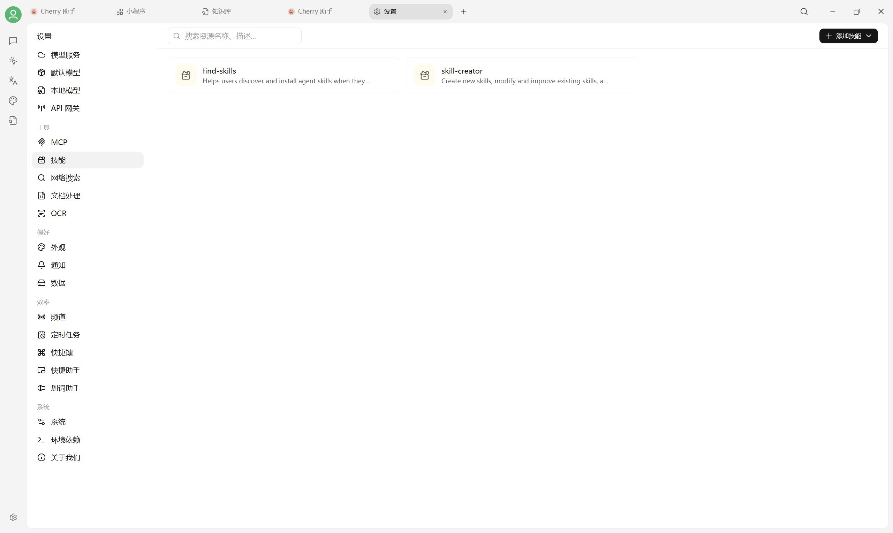
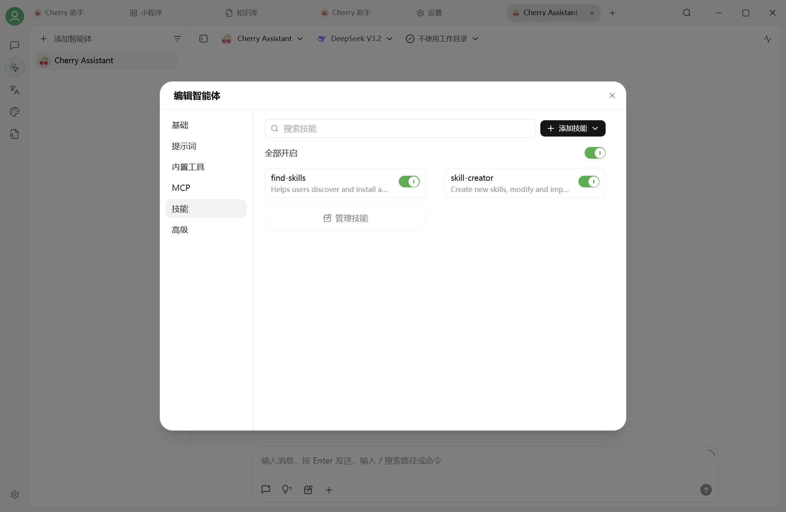

# 技能（Skills）

**技能为 AI 加装专业能力组件**。

类比：手机出厂自带相机、地图、计算器等基础应用，但若需要观看短视频则需安装抖音、若需要点外卖则需安装美团 —— **应用扩展了手机的专项能力**。

Cherry Studio 中的智能体同样如此：默认具备通用能力，若需要"撰写小红书图文"、"起草专利申请"、"绘制 Mermaid 流程图"等专项任务，可**为其加装对应的技能**。

* **可加装对象**：[智能体](../../advanced-basic/agent.md)
* **不可加装对象**：[助手](../../cherrystudio/preview/assistants.md) 和底层模型
* **启用效果**：处理相关任务时，AI 自动按技能定义的专业方式响应

> 推荐先阅读 [概念入门](../../advanced-basic/concepts-101.md) 了解技能、MCP、助手的差异。

### 在哪里管理技能

打开 `设置 → 技能`：

<figure><figcaption>
技能管理面板
</figcaption></figure>

可看到：

* **技能卡片**：展示当前已导入的技能名称与说明
* **搜索框**：按技能名称或说明查找
* **添加技能**：提供在线搜索、系统搜索和本地导入三种入口


当前 V2 技能管理页采用卡片式列表，不再区分「已安装 / 内置」两个列表。需要审阅技能文件时，请在导入前检查 ZIP 或文件夹内容；在线搜索结果如提供外部源码链接，也可先打开核对。


### 安装技能

有两种方式：

**方式一：让 Agent 帮你装**（最简单）

在智能体对话中直接对一个 Agent 说，例如：

> "请帮我安装一个可以做小红书图文的技能。"

Agent 会自动搜索注册表并完成安装。空态面板里也有一条同样的官方提示。

**方式二：手动安装**

打开 `设置 → 技能`，点击右上角 **添加技能**，根据需要选择：

* **在线搜索**：从在线技能市场搜索并安装
* **系统搜索**：扫描并导入本机其他兼容工具已经安装的技能；出现名称冲突时不会覆盖现有技能
* **本地导入**：选择一个或多个 ZIP 文件，或选择包含 `SKILL.md` 的技能目录；也可以把 ZIP 文件或目录拖进导入区

安装成功后，技能会出现在技能卡片列表中，并可在 Agent 设置中启用。

### 在 [智能体](../../advanced-basic/agent.md) 中启用

除了在 `设置 → 技能` 中做全局管理，也可以进入单个 Agent 的编辑界面查看它当前可用的技能：

<figure><figcaption>
智能体编辑界面中的技能 Tab
</figcaption></figure>

* 进入 Agent 编辑界面 → `技能` 选项卡
* 查看当前可用技能，并通过搜索框筛选
* 通过单个技能右侧的开关决定是否启用，或使用 **全部开启**
* 点击 **添加技能** 可在编辑 Agent 的同时补充技能；点击 **管理技能** 可前往全局技能管理页
* 技能开关会随 Agent 设置自动保存
* Agent 会根据任务内容自主决定何时调用已启用的技能

### 技能 vs MCP 工具 vs Provider

| 类型 | 提供方 | 适合做什么 |
|---|---|---|
| **技能（Skills）** | 内置或第三方技能包 | 模板化任务（写邮件 / 画图 / 写 PPT） |
| **[MCP 工具](../../advanced-basic/mcp/)** | 任意 MCP Server | 需要调用外部 API / 系统命令的任务 |
| **Provider 模型** | 各 AI 厂商 | 底层对话能力 |

三者可叠加：一个 Agent 可以同时挂载多个技能 + 多个 MCP 工具 + 任一 Provider 的模型。

***

### 💡 获取帮助与提交反馈

如果您在配置或使用过程中遇到任何疑问、Bug 或有功能改进建议，请参考 [反馈与建议](../../question-contact/suggestions.md) 中提供的官方渠道。
