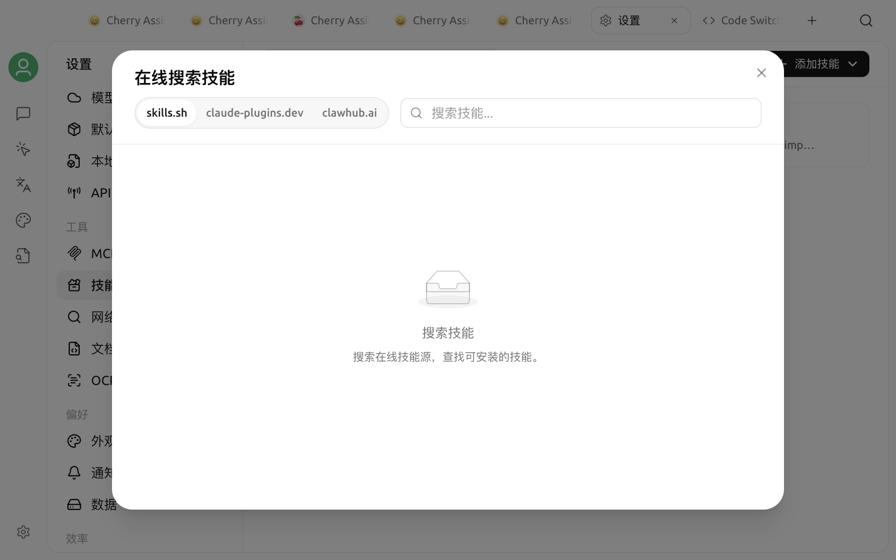

# 技能（Skills）

技能是一组供智能体按需读取的专业说明和配套文件。它可以规定完成某类任务的步骤、格式和工具用法，也可以附带脚本、参考资料或资源文件。例如，一个文档审查技能可以统一检查清单和交付格式。

技能不会改变底层模型，也不是单独运行的应用。Cherry Studio V2 先把技能安装到全局技能库，再由你决定为哪些[智能体](../../advanced-basic/agent.md)启用；同一技能可以供多个智能体使用，每个智能体的启用状态彼此独立。


当前 V2 技能用于智能体，不用于普通助手。安装到全局技能库不代表所有智能体都会自动启用它。


## 安装与启用的区别

| 操作 | 作用范围 | 结果 |
| :--- | :--- | :--- |
| 安装 | 全局技能库 | 技能出现在**设置 → 技能**和[资源库](../../cherrystudio/preview/library.md)中 |
| 启用 | 单个智能体 | 技能链接到该智能体工作区，运行时可被发现和使用 |
| 停用 | 单个智能体 | 只从该智能体移除，不影响其他智能体和全局技能文件 |
| 卸载 | 全局 | 删除技能文件，并从所有启用它的智能体中移除 |

Cherry Studio 自带的内置技能会在创建新智能体时默认启用。你之后对某个智能体做出的启用或停用选择会保留；应用更新内置技能时不会重置这些选择。

## 从在线市场安装

1. 打开 **设置 → 技能**。
2. 在右上角搜索框输入能力名称。
3. 在 `claude-plugins`、`skills.sh` 或 `clawhub` 标签中切换查看结果。
4. 点击结果可预览描述、作者、来源和统计信息。
5. 点击 **安装**。

在线安装需要网络连接。从 `claude-plugins` 或 `skills.sh` 安装时还需要系统能够运行 Git；安装过程会下载对应仓库或技能包。

新安装的第三方技能只进入全局技能库，不会自动给所有智能体启用。请继续完成“为智能体启用”步骤。

## 从本地文件安装

在 **设置 → 技能** 页面，可以：

* 点击**从 ZIP 文件安装**并选择压缩包；
* 点击**从文件夹安装**并选择技能目录；
* 把一个 ZIP 文件或目录拖到页面的安装区域。

本地包中必须包含 `SKILL.md`。该文件提供技能名称、说明和主要指令；技能也可以包含 `scripts/`、`references/`、`assets/` 等配套目录。

也可以在[资源库](../../cherrystudio/preview/library.md)的技能分类中使用导入按钮，从 ZIP 文件或目录安装。资源库目前用于查看已安装技能和本地导入；需要搜索在线市场时，请前往 **设置 → 技能**。


第三方技能可能包含命令、脚本或要求智能体访问外部服务的指令。安装前检查来源，安装后在文件树中阅读 `SKILL.md` 和脚本内容，只在可信工作区中启用。


## 让智能体安装或创建技能

所有智能体都可以使用内置的技能管理工具。可以直接要求智能体：

> 搜索一个适合检查产品文档的技能，说明来源和用途，等我确认后再安装。

通过对话安装时，智能体从市场搜索并安装技能，然后只为当前智能体启用，不会影响其他智能体。

也可以让智能体创建新技能。它会先初始化技能目录，写入 `SKILL.md` 和所需配套文件，再注册到全局技能库并为当前智能体启用。创建后，建议在 **设置 → 技能** 中检查文件内容，再用一个小任务验证行为。

## 为智能体启用

1. 打开[资源库](../../cherrystudio/preview/library.md)，进入**智能体**。
2. 打开一个已经保存的智能体进行编辑。
3. 在**能力扩展**区域选择**技能**标签。
4. 点击添加按钮，选择全局技能库中的技能。
5. 保存设置并开始新任务验证。

技能启用状态按智能体保存。要从某个智能体停用技能，在同一位置把它移除即可。

运行时，Cherry Studio 会把启用的技能链接到智能体首个工作区目录下的 `.claude/skills/`。因此智能体需要有可访问的工作区目录；如果同名位置已经存在普通目录而不是 Cherry Studio 管理的链接，启用会失败。


启用技能并不表示每条消息都强制使用它。智能体会根据技能名称、说明和当前任务判断是否加载；如果任务必须使用某个技能，请在提示词中明确指定技能名称。


## 查看与卸载

在 **设置 → 技能** 中选择一个已安装技能，可以查看完整文件树。Markdown 文件会直接渲染，脚本和其他文本文件会以代码方式显示。

第三方技能可以通过右键菜单、详情页删除按钮或多选模式批量卸载。内置技能不能在此卸载，但可以针对单个智能体停用。

卸载是全局操作：技能文件会被删除，所有智能体工作区中的对应链接和启用记录也会一并移除。如果只是不想让一个智能体使用某项技能，请停用而不是卸载。

## 技能与 MCP 的区别

| 能力 | 技能 | [MCP](../../advanced-basic/mcp/) |
| :--- | :--- | :--- |
| 主要内容 | 工作方法、提示说明、脚本与参考资料 | 由 MCP Server 暴露的可调用工具或数据 |
| 是否需要持续运行服务 | 通常不需要 | 取决于 MCP Server |
| 典型用途 | 固化写作流程、检查清单、生成规范 | 查询数据库、调用外部 API、控制其他系统 |

技能可以指导智能体何时以及如何调用 MCP 工具，两者可以同时启用。

## 技能没有生效

依次检查：

1. 技能是否已经出现在全局技能库。
2. 是否为当前智能体启用，而不是只完成了安装。
3. 当前智能体是否配置了有效的工作区目录。
4. `.claude/skills/` 下是否存在同名普通目录导致链接冲突。
5. `SKILL.md` 的名称和说明是否足以让智能体识别当前任务。

如果刚修改了技能文件，可以开始一个新会话重新验证。通过智能体管理工具创建或修改的技能文件会直接生效，不需要额外打补丁或重复安装。
