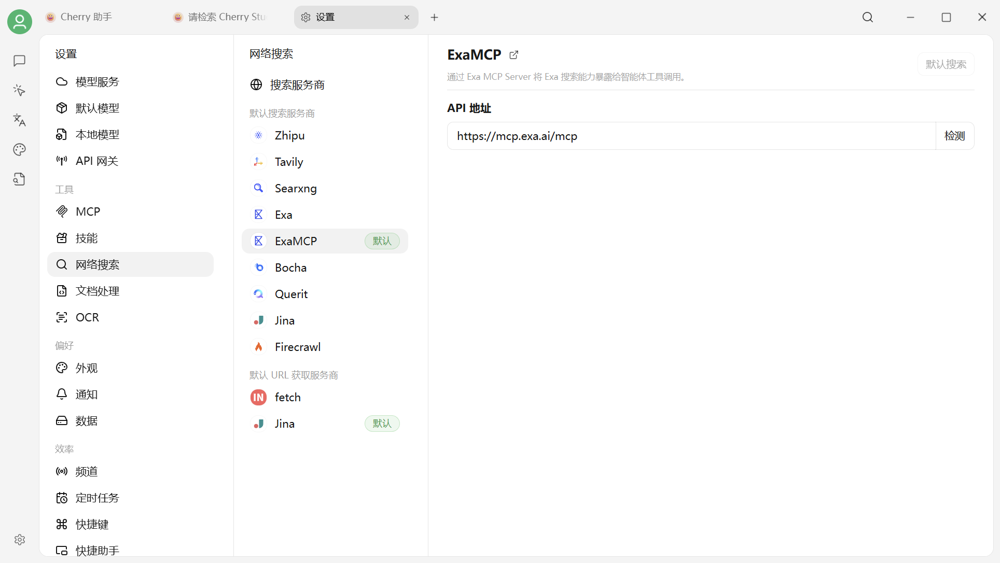
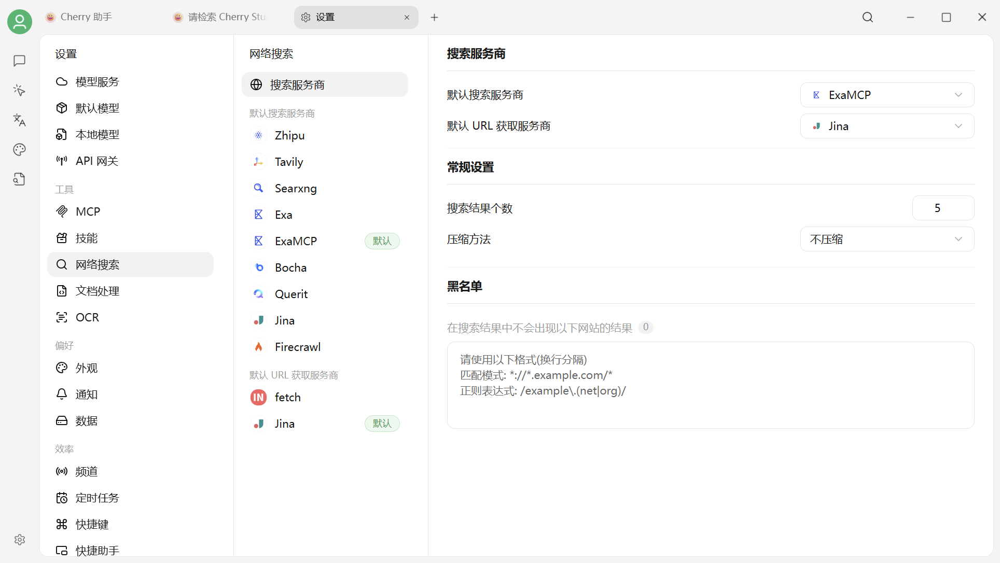
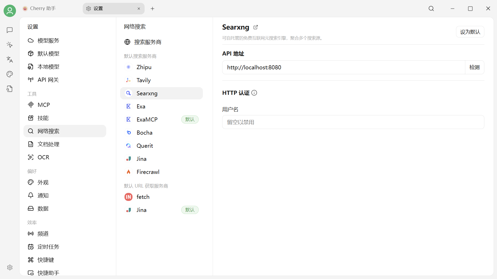
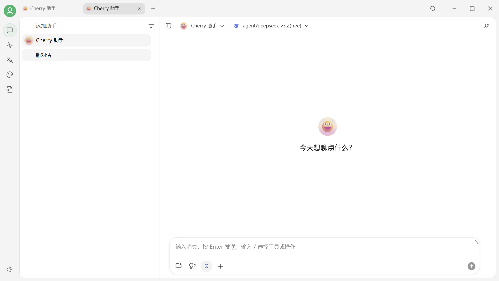
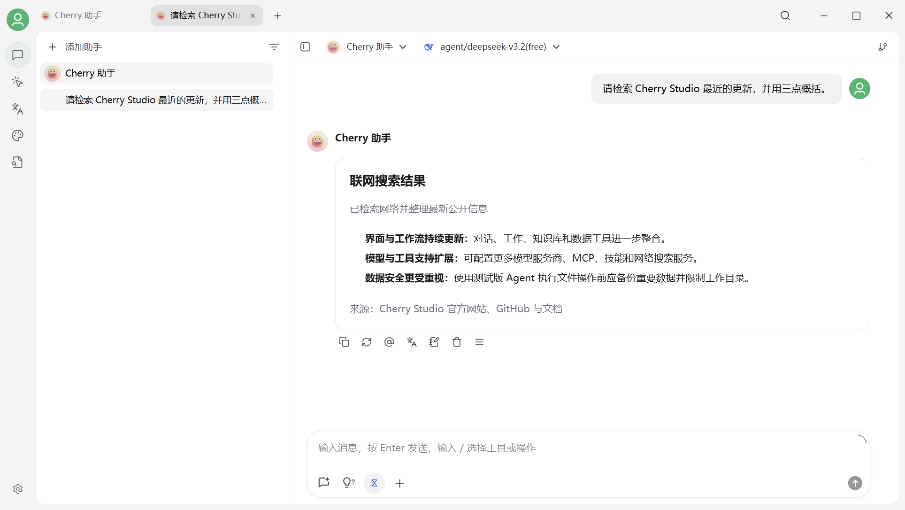

# 网络搜索配置与使用

Cherry Studio 可以通过网络搜索服务商检索实时信息，并通过 URL 获取服务商读取搜索结果中的网页。使用前需要先在设置中配置并选择对应的服务商。

***

### 启用步骤

1. **打开设置菜单**
   * 启动 Cherry Studio 应用。
   *   在主界面中，找到并点击 **设置 (Settings)** 图标或菜单选项；位于界面的左下角。

       <figure><figcaption>
从设置进入网络搜索
</figcaption></figure>
2. **访问网络搜索配置**
   *   在设置菜单中，找到并选择 **网络搜索** 设置。

       <figure><figcaption>
网络搜索的全局配置
</figcaption></figure>
3. **配置搜索服务商**
   * 在“网络搜索”设置页面中，选择 **搜索服务商**。
   * 当前可用于关键词搜索的服务商包括 **Zhipu、Tavily、Searxng、Exa、ExaMCP、Bocha、Querit、Jina** 和 **Firecrawl**。
   * 点击需要使用的服务商，按照右侧页面填写 API 密钥、API 地址或其他必要信息；页面提供“检测”按钮时，可先检测连接是否正常。
   * 不同服务商的免费额度、访问条件和功能范围可能不同，请以对应服务商的说明为准。

       <figure><figcaption>
选择并配置搜索服务商
</figcaption></figure>
4. **设置默认服务商和结果处理方式**
   * 点击中间栏顶部的 **搜索服务商**，进入全局配置。
   * 在 **默认搜索服务商** 中选择负责关键词检索的服务商。
   * 在 **默认 URL 获取服务商** 中选择负责读取网页内容的服务商；当前可选 **fetch** 或 **Jina**。
   * 按需要设置 **搜索结果个数**。当前默认值为 **5**，可设置范围为 1–100。
   * **压缩方法**可选择“不压缩”或“截断”。结果数量较多时，可使用截断限制传给模型的内容长度。

       <figure><figcaption>
确认全局搜索设置
</figcaption></figure>
5. **在对话界面激活网络搜索**
   * 完成上述设置后，返回到 Cherry Studio 的主 **对话界面**。
   * 在消息输入框下方的工具栏中，找到当前搜索服务商的图标。图标会随您选择的默认服务商变化，并不是固定的地球图标。
   * **点击该图标**启用网络搜索。启用后图标会高亮显示，表明当前消息将调用网络搜索。

       <figure><figcaption>
在输入框中启用网络搜索
</figcaption></figure>
6. **开始搜索！**
   * 确保网络搜索图标处于 **启用状态** 后，在输入框中输入您想要查询的 **关键词、问题或指令**。
   * 像平常一样发送消息。Cherry Studio 会调用默认搜索服务商检索信息，并根据配置读取相关网页。
   * 搜索完成后，回答中会显示 **联网搜索结果**及相关来源。

       <figure><figcaption>
使用网络搜索获取并整理最新信息
</figcaption></figure>

***

### ✨ 重要注意事项与技巧

* **搜索结果数量**:
  * 当前默认值为 **5**。结果较少时响应更快，增加数量可以覆盖更多来源。
  * 数量较大且未启用截断时，会消耗更多上下文和模型 Token。

      <figure><figcaption>
按需要调整搜索结果数量
</figcaption></figure>
* **服务商配置**:
  * 如果搜索失败，请先回到对应服务商页面检查 API 密钥、API 地址和“检测”结果。
  * Searxng 需要可访问的服务地址；API 类服务商通常需要有效的 API 密钥。
  * 关键词搜索服务商与 URL 获取服务商承担不同任务，排查问题时应分别检查。
* **建议**:
  * 刚开始使用时，建议保持默认设置。
  * 如果发现信息不足，再根据需要调整结果数量或切换搜索服务商。
  * 如果不需要实时信息，再次点击输入框下方的服务商图标即可关闭网络搜索。

***

现在您已经掌握了在 Cherry Studio 中使用网络搜索的方法。尽情利用这个功能来获取最新资讯、验证信息或探索未知吧！

***

### 💡 获取帮助与提交反馈

如果您在配置或使用过程中遇到任何疑问、Bug 或有功能改进建议，请参考 [反馈与建议](../../question-contact/suggestions.md) 中提供的官方渠道。
