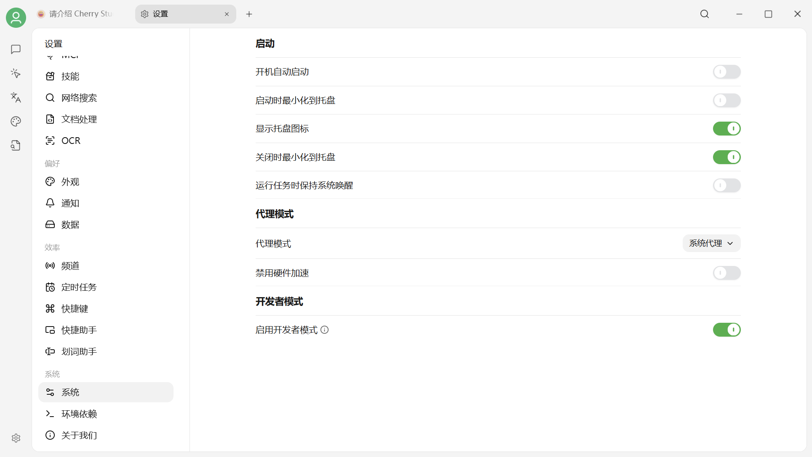
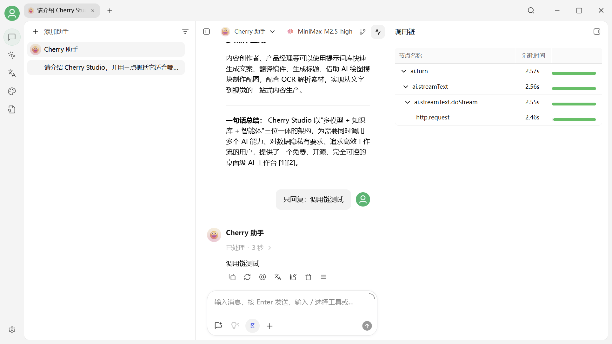
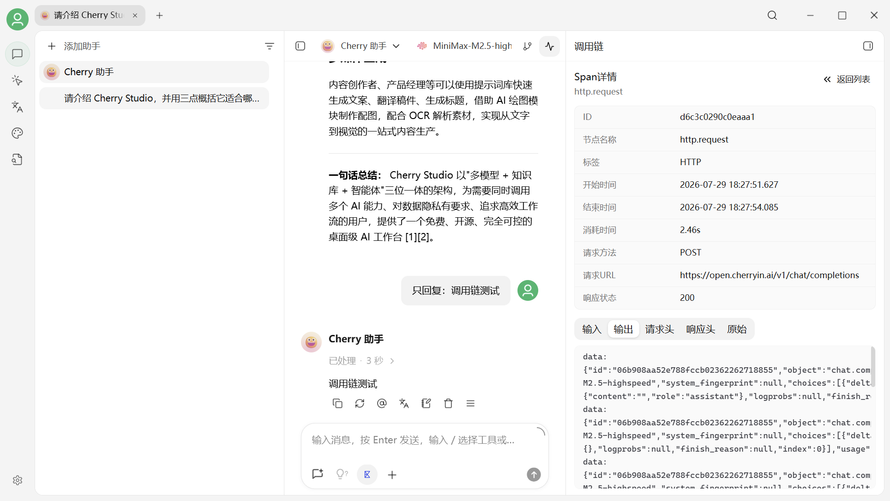

# 常见问题

## 常见错误代码

* **4xx（客户端错误状态码）**：一般为请求语法错误、鉴权失败或认证失败等无法完成请求。
* **5xx（服务器错误状态码）**：一般为服务端错误，服务器宕机、请求处理超时等。

| 错误码 | 含义 | 先检查什么 |
| --- | --- | --- |
| **400** | 请求内容不符合要求 | 参数、上下文长度、附件大小 |
| **401** | 认证失败 | API Key 是否正确或已失效 |
| **403** | 没有权限 | 账户、地区、模型权限或余额 |
| **404** | 请求地址或模型不存在 | API 地址、模型 ID |
| **422** | 请求格式可解析，但内容不合法 | 空值、字段类型和高级参数 |
| **429** | 请求过快或额度受限 | TPM、RPM、并发和账户额度 |
| **500–504** | Provider 或上游网关异常 | 服务状态、网络和稍后重试 |

### 400 错误的常见原因

1. **参数不受支持**：新建一个不带自定义参数的助手测试。
2. **上下文超过限制**：新建话题，减少历史消息、附件或最大输出。
3. **图片或附件过大**：压缩文件，或减少单次上传数量。
4. **账户前置条件未完成**：部分服务商可能要求完成绑卡、实名或开通模型。

请先查看对话中的原始错误；信息不完整时，再按下方方法查看调用链。

***

## 通过调用链查看请求与错误详情

Cherry Studio V2 的模型请求由客户端主进程执行，开发者工具的 **Network** 面板不再是可靠的排查入口。请改用内置的**调用链**：

1. 打开 **设置 → 系统**，启用**开发者模式**。
2. **完全退出并重新启动 Cherry Studio**，让开发者模式生效。

<figure><figcaption>
在设置 → 系统中启用开发者模式，然后完全退出并重新启动应用
</figcaption></figure>

3. 回到发生问题的对话或工作任务，重新执行刚才失败的操作。
4. 点击对话顶部右侧的**调用链**入口，展开请求节点。模型请求通常包含一个 `http.request` 子节点；请求失败时，对应节点会标红。

<figure><figcaption>
调用链会按层级显示 ai.turn、ai.streamText 和 http.request 等节点
</figcaption></figure>

5. 在节点详情中查看**响应状态、输入、输出、请求头、响应头**或**原始数据**。服务商返回的错误正文通常位于**输出**中。

<figure><figcaption>
选择 http.request 后，可查看请求方法、URL、响应状态及输入、输出、请求头、响应头和原始数据
</figcaption></figure>


调用链只记录启用开发者模式并重启后产生的请求。旧消息不会补录调用链；发送请求后如果面板仍显示没有 Trace 信息，可以关闭调用链面板后重新打开。不同服务商能够提供的字段可能不同；请求和响应正文过长时会被截断，因此这里展示的是可用于排查的请求详情，不保证等同于完整的原始 HTTP 抓包。



Cherry Studio 会自动遮盖常见鉴权请求头，但输入、输出、文件路径或服务商返回内容仍可能包含敏感信息。提交反馈前请再次检查并遮盖 API Key、账号、私人对话和本地路径。


***

## 公式没被渲染/公式渲染错误

* 公式未被渲染而是直接显示的公式的代码时检查公式是否有定界符

> **定界符用法**
>
> _行内公式_
>
> * 使用单个美元符号: `$formula$`
> * 或使用`\(` 和 `\)`，如：`\(formula\)`
>
> _独立公式块_
>
> * 使用双美元符号: `$$formula$$`
> * 或使用 `\[formula\]`
> * 示例: `$$\sum_{i=1}^n x_i$$`\
>   $$\sum_{i=1}^n x_i$$

* 公式渲染错误/乱码 常见在公式内包含中文内容时,尝试切换公式引擎为 KateX。

***

## 无法创建知识库/提示获取嵌入维度失败

1. 模型状态不可用

> 确认服务商是否支持该模型或确认服务商该模型服务状态是否正常。

2.使用了非嵌入模型

***

## 模型不能识图/无法上传或选择图片

首先需要确认模型是否支持识图，热门模型 Cherry Studio 会对其分类，模型名称后带小眼睛图标的即支持识图。

识图模型会支持图像文件的上传，如果模型功能未被正确匹配可在对应服务商的模型列表当中找到该模型，点击其名称后的设置按钮并勾选图像选项。

模型具体的信息可以到对应服务商找到其信息查阅。同嵌入模型一样，不支持视觉的模型不需要强制开启图像功能，勾选了图像的选项也没有作用。
