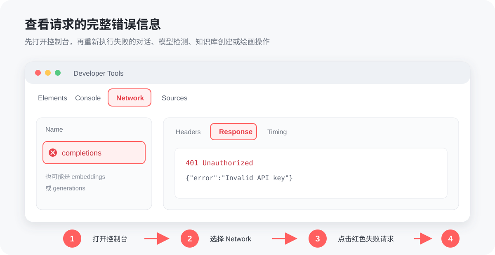

# 常见问题

## 常见错误代码

* **4xx（客户端错误状态码）**：一般为请求语法错误、鉴权失败或认证失败等无法完成请求。
* **5xx（服务器错误状态码）**：一般为服务端错误，服务器宕机、请求处理超时等。

| 错误码 | 含义 | 先检查什么 |
| --- | --- | --- |
| **400** | 请求内容不符合要求 | 参数、上下文长度、附件大小 |
| **401** | 认证失败 | API Key 是否正确或已失效 |
| **403** | 没有权限 | 账户、地区、模型权限或余额 |
| **404** | 请求地址或模型不存在 | API 地址、模型 ID |
| **422** | 请求格式可解析，但内容不合法 | 空值、字段类型和高级参数 |
| **429** | 请求过快或额度受限 | TPM、RPM、并发和账户额度 |
| **500–504** | Provider 或上游网关异常 | 服务状态、网络和稍后重试 |

### 400 错误的常见原因

1. **参数不受支持**：新建一个不带自定义参数的助手测试。
2. **上下文超过限制**：新建话题，减少历史消息、附件或最大输出。
3. **图片或附件过大**：压缩文件，或减少单次上传数量。
4. **账户前置条件未完成**：部分服务商可能要求完成绑卡、实名或开通模型。

请先查看对话中的原始错误；信息不完整时，再按下方方法打开控制台。

***

## 查看请求的完整错误信息

1. 先点击 Cherry Studio 客户端窗口，再按 <kbd>Ctrl</kbd> + <kbd>Shift</kbd> + <kbd>I</kbd>；macOS 使用 <kbd>Command</kbd> + <kbd>Option</kbd> + <kbd>I</kbd>。
2. 打开 **Network**，然后重新执行刚才失败的操作。
3. 点击带红色错误标记的请求。
4. 打开 **Response**，查看服务商返回的完整错误内容。

<figure><figcaption>
Network → 失败请求 → Response
</figcaption></figure>

| 操作场景 | 常见请求名称 |
|---|---|
| 对话、翻译、模型检测 | `completions` |
| 绘画 | `generations` |
| 知识库创建或索引 | `embeddings` |


必须先打开控制台，再重新发起请求，Network 才能记录本次错误。求助时请提供错误码和 Response 内容，但务必遮住 API Key、账号、文件路径等敏感信息。


***

## 公式没被渲染/公式渲染错误

* 公式未被渲染而是直接显示的公式的代码时检查公式是否有定界符

> **定界符用法**
>
> _行内公式_
>
> * 使用单个美元符号: `$formula$`
> * 或使用`\(` 和 `\)`，如：`\(formula\)`
>
> _独立公式块_
>
> * 使用双美元符号: `$$formula$$`
> * 或使用 `\[formula\]`
> * 示例: `$$\sum_{i=1}^n x_i$$`\
>   $$\sum_{i=1}^n x_i$$

* 公式渲染错误/乱码 常见在公式内包含中文内容时,尝试切换公式引擎为 KateX。

***

## 无法创建知识库/提示获取嵌入维度失败

1. 模型状态不可用

> 确认服务商是否支持该模型或确认服务商该模型服务状态是否正常。

2.使用了非嵌入模型

***

## 模型不能识图/无法上传或选择图片

首先需要确认模型是否支持识图，热门模型 Cherry Studio 会对其分类，模型名称后带小眼睛图标的即支持识图。

识图模型会支持图像文件的上传，如果模型功能未被正确匹配可在对应服务商的模型列表当中找到该模型，点击其名称后的设置按钮并勾选图像选项。

模型具体的信息可以到对应服务商找到其信息查阅。同嵌入模型一样，不支持视觉的模型不需要强制开启图像功能，勾选了图像的选项也没有作用。
